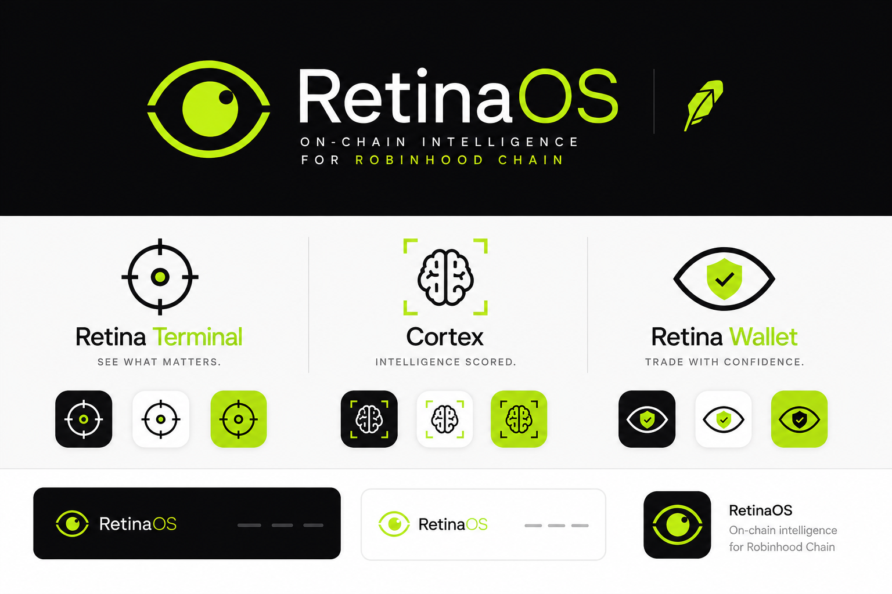

<p align="center">
  
</p>

<h1 align="center">RetinaOS</h1>
<p align="center"><b>The intelligence layer for Robinhood Chain.</b></p>
<p align="center">
  Real-time token discovery, wallet reputation scoring, and an AI market analyst —
  grounded in live on-chain data. See what matters, know who to trust, act with confidence.
</p>

<p align="center">
  <a href="https://retinaos.xyz">Landing page</a> ·
  <a href="https://terminal.retinaos.xyz">Retina Terminal (live)</a> ·
  <a href="https://retinaos.mintlify.app">Docs</a>
</p>

---

## What this is

Robinhood Chain launched and immediately became one of the highest-volume chains by DEX
activity — hundreds of tokens, thin information, no tooling built for the terrain yet.
RetinaOS is the layer that fixes that: not a wallet, not a DEX — a way to see what's
actually happening on-chain and score who you're trading against, in real time.

This repo contains two things:

1. **The RetinaOS web app** (`/app`, `/components`, `/lib`) — the marketing landing page
   and **Retina Terminal**, the live product, both live in production today.
2. **`apps/indexer`** — an in-progress, first-party blockchain indexer that will eventually
   replace the free public data APIs the Terminal runs on now. See
   [docs/INDEXER.md](docs/INDEXER.md) and [docs/DEX_REGISTRY.md](docs/DEX_REGISTRY.md).

---

## Live today — Retina Terminal

Everything below is shipped and running on real Robinhood Chain data (chain ID `4663`),
refreshed continuously, no login required to browse:

- **Discovery Feed** ([`app/terminal/page.tsx`](app/terminal/page.tsx)) — a 3-column,
  GMGN-style live board (Top / Trending / New) of tokens on Robinhood Chain, with dense
  token cards, sortable columns, and a sticky bottom status bar.
- **Token pages** ([`app/terminal/token/[address]`](app/terminal/token/%5Baddress%5D/page.tsx))
  — full price history with candlestick **and** line charts across six timeframes
  (1m/5m/15m/1H/4H/1D), log-scale toggle, live OHLC + volume readout, liquidity and
  holder data, recent trades.
- **Wallet pages** ([`app/terminal/wallet/[address]`](app/terminal/wallet/%5Baddress%5D/page.tsx))
  — holdings with per-token charts, recent on-chain activity, and a Cortex reputation score.
- **Cortex scoring** ([`lib/data/cortex.ts`](lib/data/cortex.ts), [`lib/data/risk.ts`](lib/data/risk.ts))
  — every token gets a heuristic risk score (concentration, liquidity, momentum), every
  wallet gets a reputation score with behavioral tags (Early Mover, Momentum, LP Backed,
  Sniper/Bot, Long-Term Holder). Explicitly labeled heuristic pending the real indexer.
- **AI Market Analyst** ([`app/api/terminal/analyst`](app/api/terminal/analyst/route.ts),
  ⌘K in the Terminal) — ask a question in plain English, get an answer grounded only in
  live on-chain data it can actually verify (3 tools: search tokens, get token, get wallet),
  with citations back to the source page. Provider-pluggable — runs on Claude by default,
  falls back to free-tier Gemini/Groq automatically if no Anthropic key is set (see
  [`lib/ai/provider.ts`](lib/ai/provider.ts)).
- **Live price ticker** ([`app/api/terminal/ticker`](app/api/terminal/ticker/route.ts)) —
  ETH and HOOD prices derived from cached feed data, flash-animates on change, zero extra
  API calls.
- **Connect Wallet** ([`components/terminal/ConnectWallet.tsx`](components/terminal/ConnectWallet.tsx))
  — standard multi-wallet discovery via **EIP-6963** (no wagmi/RainbowKit dependency),
  works with whatever's already installed in the browser.
- **Alerts** ([`app/terminal/alerts`](app/terminal/alerts/page.tsx)) — filter-based watchers
  over the live feed (currently client-side; server-side delivery is on the indexer roadmap).

### Data sources (today)

The Terminal runs entirely on **keyless, free** APIs — no data-provider account needed to
run this repo locally:

| Source | Used for |
|---|---|
| [GeckoTerminal](https://www.geckoterminal.com/) | Market data, OHLCV, trades, discovery feeds |
| [Blockscout](https://www.blockscout.com/) | Wallet holdings, holder counts, on-chain activity |

This is a deliberate, load-bearing trade-off: it let RetinaOS ship a fully live product
fast, but caps refresh rate (~20s), token coverage (~40 tokens), and Cortex to
feed-level heuristics. That ceiling is exactly what `apps/indexer` exists to remove —
see [Roadmap](#roadmap--the-indexer) below.

---

## Tech stack

- **Framework:** Next.js 15 (App Router), TypeScript, React 19
- **Styling:** Tailwind CSS v4
- **Data layer:** a provider-agnostic `TerminalDataProvider` interface
  ([`lib/data/index.ts`](lib/data/index.ts)) — backends can be swapped (GeckoTerminal today,
  the first-party indexer tomorrow) without touching UI code
- **AI:** Anthropic SDK (Claude) with an OpenAI-compatible fallback path (Gemini / Groq) —
  see [`lib/ai/provider.ts`](lib/ai/provider.ts)
- **Wallet:** EIP-6963 multi-wallet discovery, no third-party wallet-connect library
- **Deployment:** Vercel (landing page + Terminal), custom domains `retinaos.xyz` /
  `terminal.retinaos.xyz`
- **Indexer** (`apps/indexer`, in progress): [viem](https://viem.sh), Postgres, a
  persistent Node worker (not serverless — see [docs/INDEXER.md](docs/INDEXER.md) for why)

---

## Getting started

### Web app (landing page + Terminal)

```bash
npm install
cp .env.example .env.local   # see Environment variables below
npm run dev
```

Visit `http://localhost:3000` for the landing page, `http://localhost:3000/terminal` for
the Terminal.

### Environment variables

None are required to run the Terminal against live data — GeckoTerminal and Blockscout are
keyless. Only the AI Analyst needs a key, and it degrades to a clear "add a key" message
without one rather than failing silently.

| Variable | Required | Notes |
|---|---|---|
| `ANTHROPIC_API_KEY` | No | Enables the AI Analyst on Claude. Paid, highest priority if set. |
| `GEMINI_API_KEY` | No | Free-tier fallback for the AI Analyst if no Anthropic key. Get one at [Google AI Studio](https://aistudio.google.com/). |
| `GROQ_API_KEY` | No | Second free-tier fallback. Get one at [console.groq.com](https://console.groq.com/). |

Provider resolution order and known free-tier model traps are documented in
[`lib/ai/provider.ts`](lib/ai/provider.ts) and the
[INDEXER.md appendix](docs/INDEXER.md#appendix--ai-analyst-provider-interim).

### Indexer (`apps/indexer`) — in progress, opt-in

Not required to run the web app. See [`apps/indexer/README.md`](apps/indexer/README.md)
for full setup (needs a Postgres database and, optionally, an Alchemy API key).

```bash
cd apps/indexer
cp .env.example .env.local   # add DATABASE_URL at minimum
npm install
npm run migrate
npm run dev
```

---

## Project structure

```
app/
  page.tsx                 landing page
  terminal/                Retina Terminal (Discovery, Token, Wallet, Alerts pages)
  api/terminal/             API routes: feed, ohlcv, trades, ticker, wallet-activity, analyst
components/
  brand/                    logo, icons
  sections/                 landing page sections (Hero, Nav, Footer, CTA, ...)
  terminal/                 Terminal UI (DiscoveryBoard, TokenCard, CortexPanels,
                             ConnectWallet, AnalystPalette, charts, ...)
  ui/                       shared primitives
lib/
  data/                     TerminalDataProvider interface + GeckoTerminal/Blockscout
                             adapters, Cortex scoring, shared types
  ai/                       AI provider resolution (Claude / Gemini / Groq)
  alerts.ts, format.ts, urls.ts, utils.ts
apps/
  indexer/                  standalone first-party chain indexer (in progress)
docs/
  INDEXER.md                indexer architecture, staged build plan, milestones
  DEX_REGISTRY.md           verified on-chain contract addresses, DEX/pool registry
```

---

## Roadmap — the indexer

The Terminal's free-tier data ceiling (refresh rate, token coverage, heuristic-only Cortex,
client-only alerts) is being removed by a first-party indexer of Robinhood Chain, built
behind the same `TerminalDataProvider` interface so it ships with **no UI rewrite**.

Full architecture, data model, and a gated 9-stage execution plan (DEX registry → ingestion
→ shadow-mode cutover → realtime → real Cortex scoring → server-side alerts → public API)
live in [docs/INDEXER.md](docs/INDEXER.md). Current status:

- ✅ Target DEX identified and verified live on-chain: **Uniswap V3** on Robinhood Chain
  (chain `4663`) — see [docs/DEX_REGISTRY.md](docs/DEX_REGISTRY.md) for verified contract
  addresses, RPC/explorer endpoints, and test-fixture pools.
- ✅ Indexer service scaffolded (`apps/indexer`): Postgres schema, checkpointed block
  ingestion, `PoolCreated`/`Swap` decoding, idempotent writes — verified against a live
  database and the live chain (re-processing an identical block range produces zero
  duplicate rows).
- 🔜 Extended backfill + formal parity check against known market data (the gate before any
  of this touches production reads).
- 🔜 Shadow-mode cutover of the Discovery Feed and Token pages to the indexed database.
- 🔜 Realtime streaming (replacing the feed's poll loop), real Cortex v2 (PnL, entry-timing,
  sybil detection from full swap history), server-side alerts, public API.

---

## Contributing

This is currently a solo/small-team build. Issues and PRs are welcome — please open an
issue to discuss significant changes before submitting a PR.

## License
